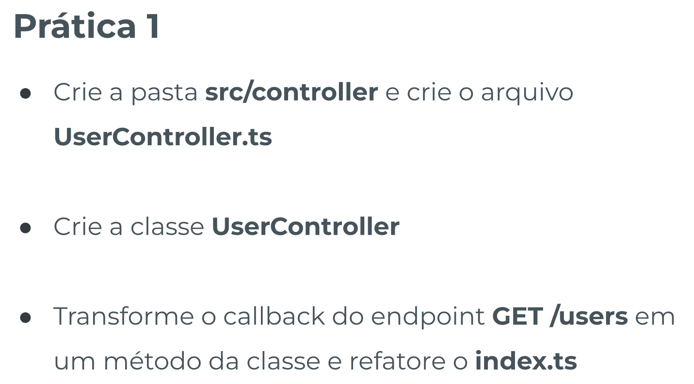
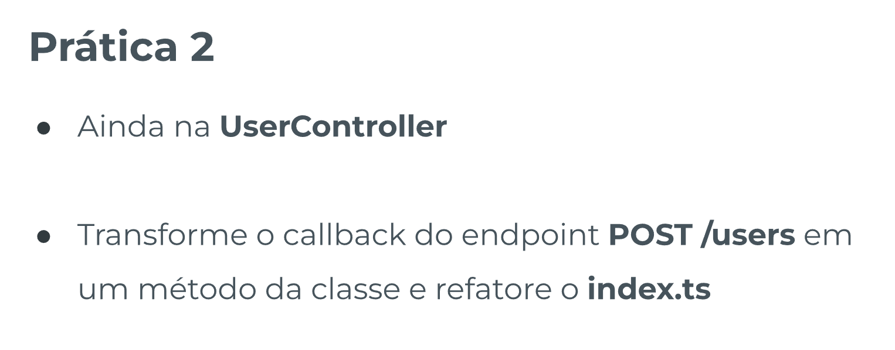
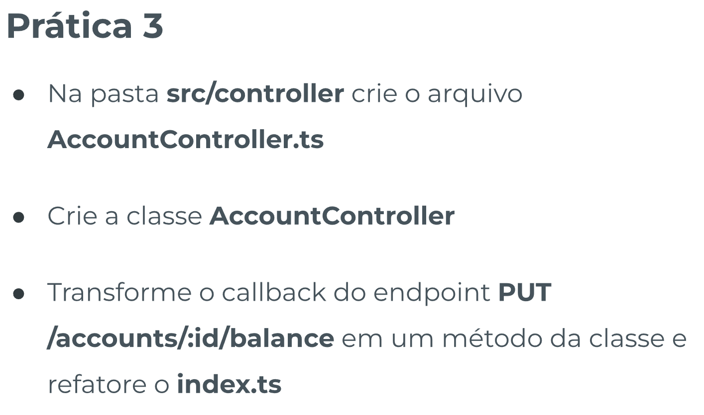
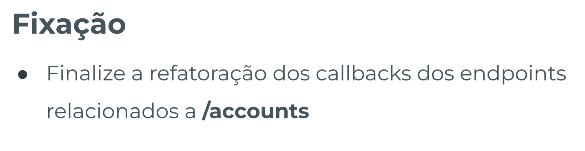

# POO 3 - Template de Prática

## Índice

-   [Prática Guiada 1](#prática-guiada-1)

    -   [Enunciado](#enunciado)

-   [Prática Guiada 2](#prática-guiada-2)

    -   [Enunciado](#enunciado-1)

-   [Prática Guiada 3](#prática-guiada-3)

    -   [Enunciado](#enunciado-2)

-   [Fixação](#fixação)

    -   [Enunciado](#enunciado-3)

-   [Resolução Única](#resolução-única)

## Prática Guiada 1

### Enunciado

[🔼](#índice)



## Prática Guiada 2

### Enunciado

[🔼](#índice)



### Resolução

[🔼](#índice)

## Prática Guiada 3

### Enunciado

[🔼](#índice)



### Resolução

[🔼](#índice)

## Fixação

### Enunciado

[🔼](#índice)

### Resolução

[🔼](#índice)



## Resolução Única

[🔼](#índice)

`index.ts`

```ts
import express, { Request, Response } from 'express';
import cors from 'cors';
import { UserController } from './controller/UserController';
import { AccountController } from './controller/AccountController';

const app = express();

app.use(cors());
app.use(express.json());

app.listen(3003, () => {
    console.log(`Servidor rodando na porta ${3003}`);
});

app.get('/ping', async (req: Request, res: Response) => {
    try {
        res.status(200).send({ message: 'Pong!' });
    } catch (error) {
        console.log(error);

        if (req.statusCode === 200) {
            res.status(500);
        }

        if (error instanceof Error) {
            res.send(error.message);
        } else {
            res.send('Erro inesperado');
        }
    }
});

// ------------------------------------ instâncias ------------------------------------

const accountController = new AccountController();
const userController = new UserController();

// ------------------------------------- users -------------------------------------

app.get('/users', userController.getUsers);

app.post('/users', userController.createUser);

// ------------------------------------- accounts -------------------------------------

app.get('/accounts', accountController.getAccounts);

app.get('/accounts/:id/balance', accountController.getBalance);

app.post('/accounts', accountController.createAccount);

app.put('/accounts/:id/balance', accountController.updateBalance);
```

`UserControllers.ts`

```ts
// Regrinha: use funções de seta nos métodos da Controller
// Um método por endpoint!

import { format } from 'date-fns';
import { Request, Response } from 'express';
import { UserDatabase } from '../database/UserDatabase';
import { User } from '../models/User';
import { UserDB } from '../types';

export class UserController {
    public getUsers = async (req: Request, res: Response) => {
        try {
            const q = req.query.q as string | undefined;

            const userDatabase = new UserDatabase();
            const usersDB = await userDatabase.findUsers(q);

            const users: User[] = usersDB.map(
                (userDB) =>
                    new User(
                        userDB.id,
                        userDB.name,
                        userDB.email,
                        userDB.password,
                        userDB.created_at
                    )
            );

            res.status(200).send(users);
        } catch (error) {
            console.log(error);

            if (req.statusCode === 200) {
                res.status(500);
            }

            if (error instanceof Error) {
                res.send(error.message);
            } else {
                res.send('Erro inesperado');
            }
        }
    };

    public createUser = async (req: Request, res: Response) => {
        try {
            const { id, name, email, password } = req.body;

            if (typeof id !== 'string') {
                res.status(400);
                throw new Error("'id' deve ser string");
            }

            if (typeof name !== 'string') {
                res.status(400);
                throw new Error("'name' deve ser string");
            }

            if (typeof email !== 'string') {
                res.status(400);
                throw new Error("'email' deve ser string");
            }

            if (typeof password !== 'string') {
                res.status(400);
                throw new Error("'password' deve ser string");
            }

            const userDatabase = new UserDatabase();
            const userDBExists = await userDatabase.findUserById(id);

            if (userDBExists) {
                res.status(400);
                throw new Error("'id' já existe");
            }

            const currentDate = new Date();

            const newUser = new User(
                id,
                name,
                email,
                password,
                format(currentDate, 'dd-MM-yyyy HH:mm:ss')
            );

            const newUserDB: UserDB = {
                id: newUser.getId(),
                name: newUser.getName(),
                email: newUser.getEmail(),
                password: newUser.getPassword(),
                created_at: newUser.getCreatedAt(),
            };

            await userDatabase.insertUser(newUserDB);

            res.status(201).send(newUser);
        } catch (error) {
            console.log(error);

            if (req.statusCode === 200) {
                res.status(500);
            }

            if (error instanceof Error) {
                res.send(error.message);
            } else {
                res.send('Erro inesperado');
            }
        }
    };
}
```

`AccountControllers.ts`

```ts
import { Request, Response } from 'express';
import { AccountDatabase } from '../database/AccountDatabase';
import { Account } from '../models/Account';
import { AccountDB } from '../types';
import { format } from 'date-fns';

export class AccountController {
    public updateBalance = async (req: Request, res: Response) => {
        try {
            const id = req.params.id;
            const value = req.body.value;

            if (typeof value !== 'number') {
                res.status(400);
                throw new Error("'value' deve ser number");
            }

            const accountDatabase = new AccountDatabase();
            const accountDB = await accountDatabase.findAccountById(id);

            if (!accountDB) {
                res.status(404);
                throw new Error("'id' não encontrado");
            }

            const account = new Account(
                accountDB.id,
                accountDB.balance,
                accountDB.owner_id,
                accountDB.created_at
            );

            const newBalance = account.getBalance() + value;
            account.setBalance(newBalance);

            await accountDatabase.updateBalanceById(id, newBalance);

            res.status(200).send(account);
        } catch (error) {
            console.log(error);

            if (req.statusCode === 200) {
                res.status(500);
            }

            if (error instanceof Error) {
                res.send(error.message);
            } else {
                res.send('Erro inesperado');
            }
        }
    };

    public getAccounts = async (req: Request, res: Response) => {
        try {
            const accountDatabase = new AccountDatabase();
            const accountsDB: AccountDB[] =
                await accountDatabase.findAccounts();

            const accounts = accountsDB.map(
                (accountDB) =>
                    new Account(
                        accountDB.id,
                        accountDB.balance,
                        accountDB.owner_id,
                        accountDB.created_at
                    )
            );

            res.status(200).send(accounts);
        } catch (error) {
            console.log(error);

            if (req.statusCode === 200) {
                res.status(500);
            }

            if (error instanceof Error) {
                res.send(error.message);
            } else {
                res.send('Erro inesperado');
            }
        }
    };

    public getBalance = async (req: Request, res: Response) => {
        try {
            const id = req.params.id;

            const accountDatabase = new AccountDatabase();
            const accountDB = await accountDatabase.findAccountById(id);

            if (!accountDB) {
                res.status(404);
                throw new Error("'id' não encontrado");
            }

            const account = new Account(
                accountDB.id,
                accountDB.balance,
                accountDB.owner_id,
                accountDB.created_at
            );

            const balance = account.getBalance();

            res.status(200).send({ balance });
        } catch (error) {
            console.log(error);

            if (req.statusCode === 200) {
                res.status(500);
            }

            if (error instanceof Error) {
                res.send(error.message);
            } else {
                res.send('Erro inesperado');
            }
        }
    };

    public createAccount = async (req: Request, res: Response) => {
        try {
            const { id, ownerId } = req.body;

            if (typeof id !== 'string') {
                res.status(400);
                throw new Error("'id' deve ser string");
            }

            if (typeof ownerId !== 'string') {
                res.status(400);
                throw new Error("'ownerId' deve ser string");
            }

            const accountDatabase = new AccountDatabase();
            const accountDBExists = await accountDatabase.findAccountById(id);

            if (accountDBExists) {
                res.status(400);
                throw new Error("'id' já existe");
            }

            const currentDate = new Date();

            const newAccount = new Account(
                id,
                0,
                ownerId,
                format(currentDate, 'dd-MM-yyyy HH:mm:ss')
            );

            const newAccountDB: AccountDB = {
                id: newAccount.getId(),
                balance: newAccount.getBalance(),
                owner_id: newAccount.getOwnerId(),
                created_at: newAccount.getCreatedAt(),
            };

            await accountDatabase.insertAccount(newAccountDB);

            res.status(201).send(newAccount);
        } catch (error) {
            console.log(error);

            if (req.statusCode === 200) {
                res.status(500);
            }

            if (error instanceof Error) {
                res.send(error.message);
            } else {
                res.send('Erro inesperado');
            }
        }
    };
}
```
